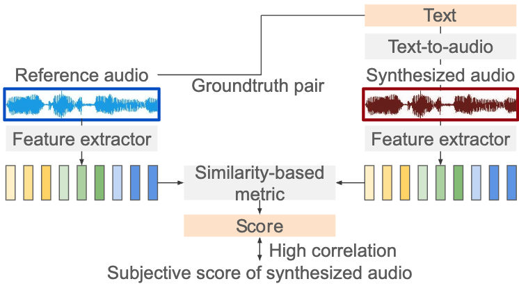

# audiobertscore
**AudioBERTScore: Objective Evaluation of Environmental Sound Synthesis Based on Similarity of Audio Embedding Sequences**  [[Paper]](https://)




---

Abstract:

We propose a novel objective evaluation metric for synthesized
audio in text-to-audio (TTA), aiming to improve the performance
of TTA models. In TTA, subjective evaluation of the synthesized
sound is an important, but its implementation requires monetary
costs. Therefore, objective evaluation such as mel-cepstral distor-
tion are used, but the correlation between these objective metrics
and subjective evaluation values is weak. Our proposed objective
evaluation metric, AudioBERTScore, calculates the similarity be-
tween embedding of the synthesized and reference sounds. The
method is based not only on the max-norm used in conventional
BERTScore but also on the p-norm to reflect the non-local nature
of environmental sounds. Experimental results show that scores
obtained by the proposed method have a higher correlation with
subjective evaluation values than conventional metrics.

---

## 🛠️ Install

To use `audiobertscore`, run the following:

```bash
git clone https://github.com/lourson1091/audiobertscore.git